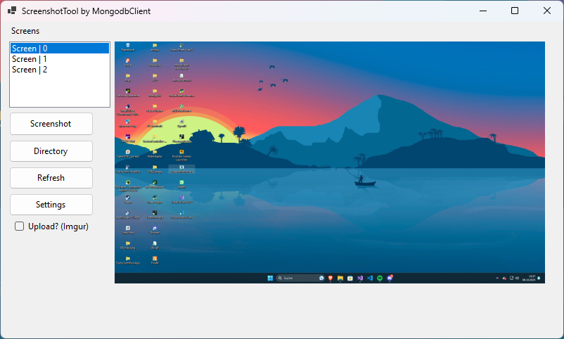
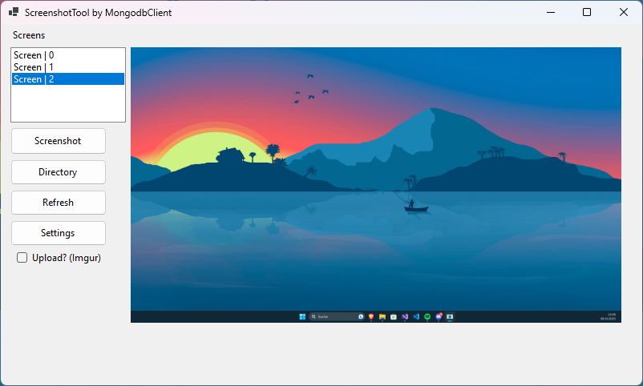

# ScreenshotTool-MongodBClient

Simple Screenshot tool with ImgurAPI integratation  V1.0

 

# Update V1.0.1

// Implementet new settings button 
// Improve code performance 
// Add config to save settings 
// Fix error when screenshot spamm, when upload enabled 

 

# Update V1.0.2 / Working on

// Add galery for system based screenshots
// Add new styles
// ...
