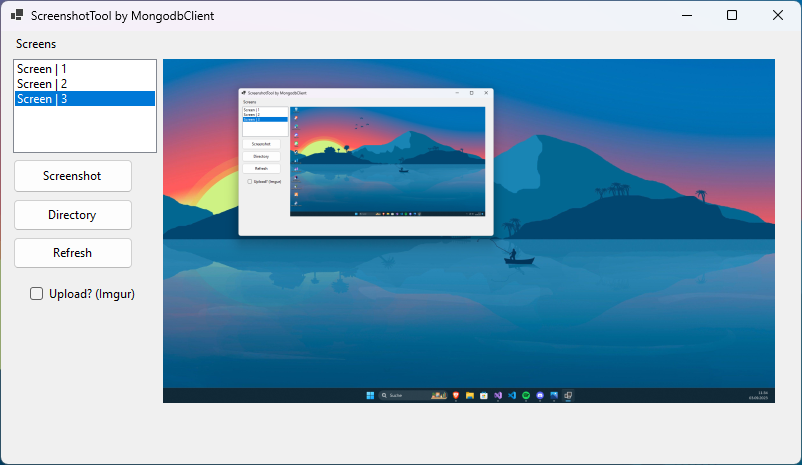

# ScreenshotTool-MongodBClient

Simple Screenshot tool with ImgurAPI integratation  V1.0

 

# Update V1.0.1

// Implementet new Settings Button
// Improve Code performance
// Add Config to save settings

 
